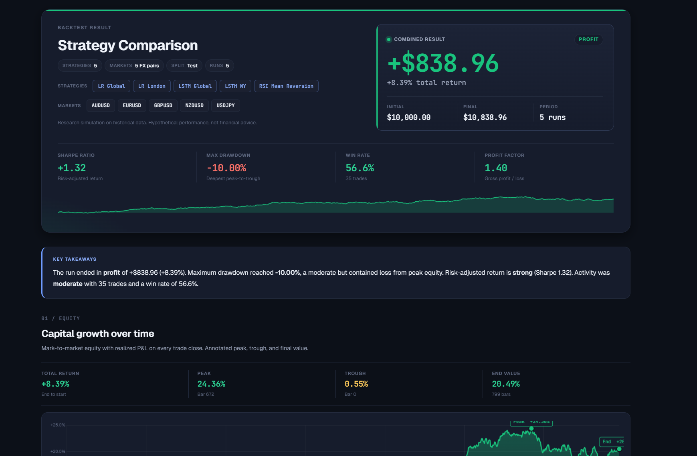
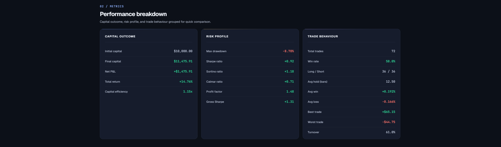
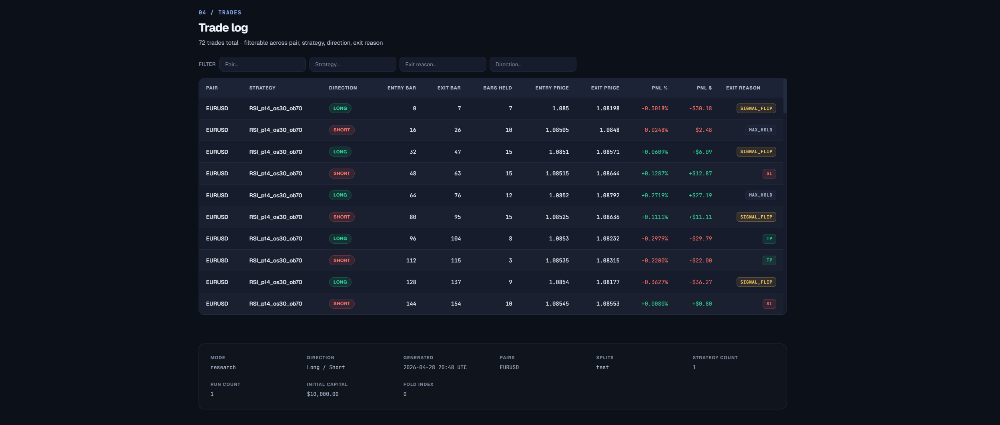
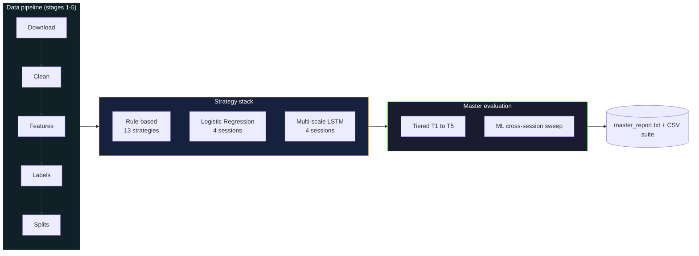
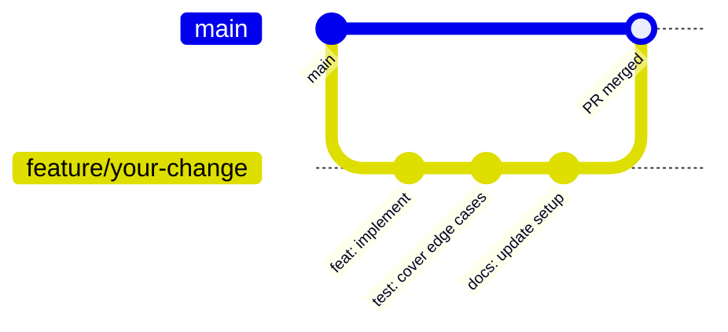

<p align="center">
  
  
  
  
  
  
  
  
</p>

Pick any two FX backtest claims out of the academic literature and the Sharpe ratios will not compare. Bar resolutions differ, spread assumptions differ, validation windows differ, and so does the implicit accounting of transaction costs. The result is a pile of strategy claims that nobody can rank against each other on equal footing.

This platform fixes that single problem. Seven USD majors, one-minute bars from January 2015 through December 2025, the same per-pair flat spread for every strategy in the system, the same locked train/val/test split, the same 0-to-100 composite score. Rule-based, calibrated linear, and multi-scale recurrent strategies all enter the same yardstick. The deliverable is the platform itself, plus answers to three research questions: RQ0 reproducibility, RQ1 session conditioning, RQ2 LSTM versus Logistic Regression on the locked 2024 to 2025 test window.

The full grid is trained (28 LR cells plus 28 LSTM cells across 7 pairs and 4 session conditions). The master evaluation has been run end-to-end on six windows, from one trading day up to the full 24-month test span. Every figure in the report gallery and every cell in the leaderboard regenerates from the committed code with no manual touch-ups.

## Documentation index

The five entries below are the canonical surface. Pick the one that matches the goal; reference docs are not meant to be read end to end.

| Document | What it covers | When to open it |
|----------|----------------|-----------------|
| [docs/REPLICATION.md](docs/REPLICATION.md) | Twelve numbered steps from `git clone` to a working backtest and a complete master evaluation. Every command, every flag, every expected output. | First time on the repo. Read this end to end. |
| [docs/SETUP.md](docs/SETUP.md) | Long-form install reference. Every CLI flag for every script. Bootstrap procedure. Three install paths. | When a flag in REPLICATION.md is unfamiliar. |
| [ARCHITECTURE.md](ARCHITECTURE.md) | Six Mermaid diagrams (system, sequence, classes, data flow, evaluation tiers, dependencies), twelve architecture decision records, source map, implementation notes. | Before refactoring or proposing a design change. |
| [docs/EXPERIMENTS.md](docs/EXPERIMENTS.md) | The three research questions, the experiment catalogue, the reproducibility checklist, the Diebold-Mariano test design, the walk-forward stability formula. | Before running the master evaluation. |
| [docs/FINDINGS.md](docs/FINDINGS.md) | Headline numbers from the 24-month master-eval run on the locked 2024 to 2025 test split: top-10 unified leaderboard, per-pair winners, family-level averages, the DM-test panel, and the verdicts on RQ0 / RQ1 / RQ2. | After a master-eval run; cross-checked with `output/master_eval/run_24month/master_report.txt`. |

The README from here on is a snapshot: motivation, demo screenshots, headline numbers, strategy menu, project layout, contributing notes.

## Quick start

The fastest path is a single bootstrap command. Run from the project root:

```bash
python bootstrap.py --no-pipeline --no-train
```

Flags used above:

- `--no-pipeline`: skip the multi-hour data download and feature build.
- `--no-train`: skip the multi-hour LR + LSTM training grid.

That single command verifies that Python is 3.11 or 3.12, creates `./venv`, upgrades pip, installs every pinned dependency from `requirements.txt`, and runs the pytest suite. Drop both flags to run the full pipeline end to end. Pass `--yes` to accept all prompts unattended.

Python 3.13 is rejected by the version check on purpose: the pinned `torch==2.6.0` does not yet ship cp313 wheels, so the install step would fail later with a less informative error. Install Python 3.11 or 3.12 (e.g. via pyenv or python.org) and re-run.

Once the script finishes, activate the environment:

```bash
source venv/bin/activate          # macOS / Linux
venv\Scripts\activate             # Windows PowerShell
```

A first backtest. Flags:

- `--pair EURUSD`: the currency pair.
- `--strategy RSI_p14_os30_ob70`: RSI mean reversion (period 14, oversold 30, overbought 70).
- `--split full`: load the cleaned full-history Parquet (rule-based strategies have no fittable parameters, so `full` is always correct for them).
- `--capital 10000`: starting capital in USD.
- `--no-browser`: write the HTML report without auto-opening it.

```bash
python backtest/run_backtest.py --pair EURUSD --strategy RSI_p14_os30_ob70 --split full --capital 10000 --no-browser
```

The console prints `Report written: backtest/reports/report_EURUSD_RSI_p14_os30_ob70_<timestamp>.html` on success. Open the HTML file in any modern browser for the equity curve, drawdown trajectory, rolling Sharpe panel, signal distribution, and full trade ledger. A pre-generated sample report sits at [docs/assets/sample_report.html](docs/assets/sample_report.html).

To regenerate the figure gallery and `TABLES.md` against the most recent master-eval run:

```bash
python scripts/make_report_plots.py
```

The script reads `output/master_eval/latest_run.txt`, resolves the per-run subdirectory, and writes 33 figures to `docs/assets/plots/run_<window>/`. Use `--eval-dir` to target a different run.

## Known replication gotchas

Notes from a fresh-clone replication pass. Each item lists the symptom, the root cause, and the fix that landed in the codebase.

- **`torch==2.6.0` will not install on Python 3.13.** The pinned wheel only exists for cp311 and cp312 at the time of writing. `bootstrap.py` rejects 3.13 up-front with a clear error message. Install Python 3.11 or 3.12 and re-run.
- **`python -m pytest tests/ -q` reports "No module named pytest".** Earlier revisions of `requirements.txt` did not list pytest, so the bootstrap test step would fail on a clean venv. The dependency is now pinned (`pytest==8.4.0`) and is installed by the same `pip install -r requirements.txt` step that bootstrap runs.
- **`scripts/download_fx_data.py` fails with a TLS verification error.** histdata.com has occasionally served an expired or untrusted certificate. The downloader now accepts `--insecure`, which sets `verify=False` on the HTTP session and prints a one-line warning so the relaxation is auditable. Use it only as long as the upstream certificate is broken; remove the flag once the site recovers.
- **`LSTM_global` (or any LSTM cell) produces no signals or a silent all-FLAT output.** The LSTM long branch reads features such as `rv_ratio_10_60` and `same_minute_prev_day_logrange` that live outside the LR scaler's `feature_cols`. If the test parquet was copied from an older clone, those columns are absent and the older code substituted zeros without complaint. The MLStrategy preflight now raises a clear `KeyError` listing the missing columns and pointing the user back at `scripts/features_fx_data.py` and `scripts/split_fx_data.py`. Do not copy `data/`, `features/`, `labels/`, or `datasets/` between clones; regenerate them via the seven-stage pipeline.
- **`StandardScaler` files missing from `scalers/`.** `models/` and `scalers/` ship as empty directories via `.gitkeep`. To fit and write the per-pair scalers without rerunning the upstream stages, run `python scripts/split_fx_data.py`. The script writes one `scalers/{PAIR}_scaler.pkl` per pair as a dict `{"scaler": StandardScaler, "feature_cols": [...]}`.

## At a glance

<table>
  <tr>
    <td width="50%"><b>Pairs</b></td>
    <td>EURUSD, GBPUSD, USDJPY, USDCHF, USDCAD, AUDUSD, NZDUSD (seven USD majors)</td>
  </tr>
  <tr>
    <td><b>Bar resolution</b></td>
    <td>1 minute, sourced from histdata.com</td>
  </tr>
  <tr>
    <td><b>Date span</b></td>
    <td>2015-01-01 through 2025-12-31</td>
  </tr>
  <tr>
    <td><b>Trained model grid</b></td>
    <td>56 checkpoints: 28 Logistic Regression + 28 multi-scale LSTM (7 pairs x 4 session conditions x 2 architectures)</td>
  </tr>
  <tr>
    <td><b>Strategy stack</b></td>
    <td>13 named rule-based variants + 8 named ML strategies (LR_global, LR_london, LR_ny, LR_asia, and the four LSTM equivalents)</td>
  </tr>
  <tr>
    <td><b>Evaluation</b></td>
    <td>Five-tier rule-based pipeline (T1 to T5) and an ML cross-session sweep (8 strategies x 7 pairs x 4 eval sessions x N spread multipliers)</td>
  </tr>
  <tr>
    <td><b>Scoring</b></td>
    <td>Composite 0 to 100, weighted 35 / 25 / 25 / 15 across net Sharpe, Sortino, Calmar, drawdown safety</td>
  </tr>
  <tr>
    <td><b>Significance test</b></td>
    <td>Diebold-Mariano with the Harvey-Leybourne-Newbold small-sample correction, four comparison families per pair</td>
  </tr>
  <tr>
    <td><b>Output gallery</b></td>
    <td>33 publication-grade figures plus TABLES.md per run, regenerated for six windows: 1 day, 1 week, 1 month, 6 months, 12 months, 24 months</td>
  </tr>
  <tr>
    <td><b>Test framework</b></td>
    <td>pytest, 9 test files covering engine, walk-forward, sessions, and ML adapters</td>
  </tr>
</table>

## Demo

The HTML backtest report renders an interactive dashboard: equity curve, drawdown trajectory, rolling Sharpe, signal distribution, and per-trade ledger. The five screenshots below capture the most informative panels from a recent run. The full interactive report is at [docs/assets/sample_report.html](docs/assets/sample_report.html); download and open in any modern browser.

<table>
  <tr>
    <td align="center" width="50%">
      
      <br/><sub>Report header. Thirteen headline metrics and the run configuration block.</sub>
    </td>
    <td align="center" width="50%">
      
      <br/><sub>Equity curve over the test window with drawdown overlaid in the secondary axis.</sub>
    </td>
  </tr>
  <tr>
    <td align="center">
      
      <br/><sub>Rolling Sharpe over a 390-bar window. Tracks regime-by-regime stability inside a single trading day.</sub>
    </td>
    <td align="center">
      
      <br/><sub>Signal distribution histogram and a recent-trade ledger with realised PnL per trade.</sub>
    </td>
  </tr>
  <tr>
    <td colspan="2" align="center">
      
      <br/><sub>Multi-strategy head-to-head. Three equity curves on shared axes for direct visual comparison.</sub>
    </td>
  </tr>
</table>

A second gallery sits under `docs/assets/plots/`. Each `run_<window>/` subdirectory holds 33 figures and a `TABLES.md`, regenerated by `scripts/make_report_plots.py` from the corresponding master-eval CSV outputs. The publication-grade figures cover the data layout, the buy-and-hold baseline, the rule-based selection funnel, the unified leaderboard, the cross-session transfer matrices, the in-domain-versus-transfer gaps, the LR feature importance heatmap, the Diebold-Mariano forest plot, the risk-return scatters, and the per-pair winners.

## Headline numbers (2024 to 2025 test window, 24-month run)

The numbers below come from the 24-month master-eval run on the locked 2024-01-01 to 2025-12-31 test split. Source artefacts live at `output/master_eval/run_24month/master_report.txt` and the CSV suite alongside it.

The unified leaderboard top three:

| # | Grade | Score | Pair | Type | Strategy | Sharpe | MaxDD | Trades |
|---|:-----:|------:|------|------|----------|-------:|------:|-------:|
| 1 | A | 84.7 | USDCHF | ML | LSTM_ny  (eval=asia)        | +2.83 | -0.45% | 32 |
| 2 | B | 77.2 | EURUSD | ML | LR_asia  (eval=global)      | +2.71 | -0.74% | 267 |
| 3 | B | 76.0 | USDCAD | RB | MACD_f26_s65_sig9           | +2.51 | -0.75% | 23 |

Three of the 581 evaluated configurations clear grade B. The remaining 578 sit at C or below. The average net Sharpe across all valid ML cells is negative on every pair before cost gating, which puts the three top cells in the right tail of an otherwise unprofitable distribution.

Diebold-Mariano significance counts at the 5 percent level:

- best rule-based versus buy-and-hold: 0 of 7 pairs significant.
- best ML versus buy-and-hold: 0 of 7 pairs significant.
- in-domain training versus cross-session transfer: 2 of 14 probes significant (USDCHF London, NZDUSD Asia).
- ML champion versus runner-up: 0 of 7 pairs significant.

Two significant in-domain probes out of fourteen approximates the false-positive rate expected under the null at alpha = 0.05. Session conditioning is therefore not a reliable effect across pairs, even though particular cells (notably USDCHF LSTM_ny -> asia at +2.83 Sharpe) show real edges.

The honest summary: a small number of high-composite cells exist and are reproducible, but the trade counts on the winning configurations are too low to reject the null hypothesis under DM. Strategies that do beat buy-and-hold on point estimates do not yet beat it with statistical significance over a 24-month window. Negative findings of this shape are reported as findings; that is the point of the platform.

Reading these results back into the three research questions:

- **RQ0** (reproducibility): yes. Independent re-runs from the same checkpoints produce byte-identical `results_all.csv` files.
- **RQ1** (session conditioning): mixed and pair-specific. The in-domain-versus-transfer DM probe passes for two of fourteen cells; the rest are statistically indistinguishable.
- **RQ2** (LR versus LSTM): no on aggregate. Family-level average net Sharpe is -7.90 for LR cells and -6.43 for LSTM cells; the architecture difference is small relative to the variance across pairs and sessions, and the ML-champion-versus-runner-up DM test never reaches significance.

## What the three research questions are

The platform is built around three questions. They are not equally weighted; the first is the precondition for the other two.

**RQ0 is reproducibility.** Run the master evaluation twice with the same seeds, the same splits, and the same model checkpoints. The two `results_all.csv` files have to be byte-identical. If they are not, the platform has failed RQ0 and the rest of the answers do not survive scrutiny. The pytest suite covers the regressions that erode reproducibility quietly: wrong index alignment between features and labels, scaler fit on the wrong split, session masks that include or exclude the boundary minute inconsistently, fold-path resolution drifting between row-index slicing and on-disk Parquet reads.

**RQ1 is session conditioning.** Train one model per session, train a global model on everything, and compare cost-adjusted Sharpe. The hypothesis is that intraday FX regimes differ enough across Asia, London, and New York that pooling discards usable signal. The result materialises as a 4-by-4 transfer matrix per pair per model class. Diagonal cells are in-domain (trained on London, evaluated on London). Off-diagonal cells are transfer (trained on London, evaluated on NY). The diagonal needs to beat the off-diagonal for session conditioning to be worth the extra training cost.

**RQ2 is model complexity.** A two-branch multi-scale LSTM versus a calibrated Logistic Regression on the same 18 features, both fit per (pair, session). The metric is cost-adjusted Sharpe, not classification AUC. A model that scores 0.62 AUC and a net Sharpe of -0.4 has not done its job. A 40-line rule-based strategy that scores 0.51 AUC and a net Sharpe of +0.8 has. Economic metrics dominate over classification metrics in the scoring; classification metrics are diagnostic only.

## Architecture

Three layers connected by a fixed data and evaluation flow.



Stages 1 to 5 turn raw histdata CSVs into per-pair Parquets of around 70 feature columns and a three-class label. Stage 6 trains models. Stage 7 evaluates. Each stage is a separate script writing to a fixed location with a fixed schema, so a failure in one stage can be repaired and rerun without invalidating the rest.

Three layers in the strategy stack. Layer one is the 13 rule-based families. Layer two is Logistic Regression on a frozen 18-feature schema, fit per (pair, session). Layer three is a two-branch LSTM. The short branch sees a 15-bar window of returns and short-horizon volatility. The long branch sees a 60-bar window of multi-scale realised volatility. The two branches merge into a 64-d vector, the 4-d session one-hot is concatenated, and a small MLP head produces a three-class softmax over DOWN, FLAT, UP.

Tiering of the master evaluation is deliberate. T1 screens, T2 sweeps session and direction, T3 sweeps a small TP/SL grid, T4 measures stability across five walk-forward folds, T5 produces the final result on the locked test split. T1 through T3 only ever touch validation data. T4 only ever touches training folds. T5 is the only tier that touches the test split, and it touches it exactly once per evaluation cycle.

A longer treatment lives in [ARCHITECTURE.md](ARCHITECTURE.md) with all six diagrams, the architecture decision records, the source map, and a section on implementation pitfalls (label remap, batched LSTM inference, scaler contract, fold parquet paths).

## Strategy menu

### Rule-based stack (13 named strategies)

| Family | Variants | What it trades |
|--------|----------|----------------|
| MA Crossover | `MACrossover_f20_s50_EMA`, `MACrossover_f50_s200_EMA`, `MACrossover_f20_s50_SMA` | Signed difference between fast and slow moving average |
| Momentum | `Momentum_lb60`, `Momentum_lb120` | Sign of the n-bar return |
| Donchian | `Donchian_p20`, `Donchian_p55` | Breakouts of the rolling n-bar high or low |
| RSI | `RSI_p14_os30_ob70`, `RSI_p14_os20_ob80` | Mean reversion against the n-bar Relative Strength Index |
| Bollinger | `BB_p20_std2_0`, `BB_p60_std2_0` | Reversals at the upper and lower bands |
| MACD | `MACD_f26_s65_sig9`, `MACD_f78_s195_sig13` | Crossovers of the MACD line and its signal line |

### Machine learning stack (8 named strategies, 56 trained checkpoints)

Each ML model class produces four named strategies, one per session condition. With 7 pairs in the universe, that is 28 LR checkpoints plus 28 LSTM checkpoints on disk under `models/global/` and `models/session/{london,ny,asia}/`.

| Strategy | Architecture | Training data |
|----------|--------------|---------------|
| `LR_global` | LogisticRegression(C=0.1, multinomial, balanced, seed=42) on 18 features | All training-split bars |
| `LR_london`, `LR_ny`, `LR_asia` | Same architecture, same scaler as `LR_global` | Training-split bars filtered to the named session |
| `LSTM_global` | Two-branch LSTM (15-bar short branch + 60-bar long branch), session injection at merge, 3-class softmax head | All training-split bars |
| `LSTM_london`, `LSTM_ny`, `LSTM_asia` | Same architecture as `LSTM_global` | Training-split bars filtered to the named session |

### Composite scoring

A single 0-to-100 score ranks every strategy in every tier. Two hard gates remove statistically meaningless or economically catastrophic strategies before scoring.

| Component | Weight | Cap | Floor |
|-----------|:------:|:----:|:------:|
| Net Sharpe | 35% | 5.0 | 0 |
| Sortino | 25% | 5.0 | 0 |
| Calmar | 25% | 3.0 | 0 |
| Drawdown safety | 15% | 100 | 0 |

Hard gates: `n_trades < 10` zeros the score. `max_drawdown < -0.95` zeros the score. Grades: A (80+), B (60-79), C (40-59), D (20-39), F (under 20).

### Per-pair flat spreads

| Pair | Spread (pips) | Pair | Spread (pips) |
|------|:-------------:|------|:-------------:|
| EURUSD | 0.6 | USDCHF | 1.0 |
| GBPUSD | 0.8 | USDCAD | 1.0 |
| USDJPY | 0.7 | NZDUSD | 1.4 |
| AUDUSD | 0.8 | | |

The spread enters the cost model multiplied by the pair's pip size (`0.0001` for non-JPY pairs, `0.01` for JPY pairs). The same flat number applies to every strategy on every bar. That is harder to game.

### Locked temporal splits

| Window | Range | Purpose |
|--------|-------|---------|
| Train | 2015-01-01 to 2021-12-31 | Model fitting; no tuning decisions read from this window |
| Validation | 2022-01-01 to 2023-12-31 | All tuning decisions (T1 to T3 of the rule-based path) |
| Test | 2024-01-01 to 2025-12-31 | Final evaluation; touched once per cycle |
| Folds | 5 contiguous slices inside the training span | Stability analysis (T4) |

These dates are constants in `config/constants.py`, not CLI flags. Changing them invalidates the comparability the platform is built around. The master evaluation script reads them at startup and refuses any override that lies outside the locked test window.

## Master evaluation

The unified evaluation script writes a per-run subdirectory under `output/master_eval/`. Each run produces a `master_report.txt` plus a CSV suite (ten distinct families: T1-to-T5 rule-based rows, ML cross-session rows, the unified leaderboard, best/worst per pair, per-pair LR transfer matrices, per-pair LSTM transfer matrices, session generalisability, LR feature importance, the Diebold-Mariano test panel, and the cost break-even table). The transfer matrix families expand to seven files each on disk, one per pair.

```bash
# Headline run on the full locked test split, single spread.
python scripts/master_eval.py --spreads 1.0

# Single calendar year on the test split.
python scripts/master_eval.py --eval-year 2024 --spreads 1.0

# Custom date window inside the test split.
python scripts/master_eval.py --from 2024-01-01 --to 2024-03-31 --spreads 1.0

# Three-spread sweep so cost_breakeven.csv populates.
python scripts/master_eval.py --spreads 0.5 1.0 2.0

# All six standard windows in a single orchestrator call.
python scripts/run_all_windows.py --workers 8
```

After a run completes, the directory `output/master_eval/run_<window>/` holds:

- `master_report.txt`: definitive prose report; read this first.
- `results_rule_based.csv`: every T1-to-T5 row with thirteen metrics each.
- `results_ml.csv`: every ML cross-session row.
- `results_all.csv`: combined, sorted by composite score; canonical leaderboard.
- `best_worst_per_pair.csv`: unified per-pair top and bottom.
- `transfer_matrix_lr_<PAIR>.csv` and `transfer_matrix_lstm_<PAIR>.csv`: 4-by-4 cross-session Sharpe matrices, one per (model_class, pair).
- `session_generalisability.csv`: average off-diagonal Sharpe per training session.
- `lr_feature_importance.csv`: top-five features per (pair, session) cell.
- `dm_test_results.csv`: all four DM comparison families per pair.
- `cost_breakeven.csv`: requires at least two spread multipliers to populate.

A figure gallery regenerates from the same per-run directory. `scripts/make_report_plots.py` reads the eval CSVs, builds 33 publication-grade figures plus a `TABLES.md` index, and writes them under `docs/assets/plots/run_<window>/`. To regenerate every gallery in one shot:

```bash
for window in run_1day run_1week run_1month run_6month run_12month run_24month; do
  python scripts/make_report_plots.py --eval-dir output/master_eval/$window --out-dir docs/assets/plots/$window
done
```

## Project structure

```
forex-algo-trading/
│
├── 📂 backtest/                   Backtest engine, strategies, CLI, HTML reports
│   ├── engine.py                  run_backtest, run_wf_folds, BacktestResult
│   ├── strategies.py              STRATEGY_REGISTRY (13 rule-based) + ML adapters
│   ├── run_backtest.py            Per-strategy CLI with multi-strategy support
│   ├── report_generator.py        HTML report builder driven by Jinja templates
│   ├── reports/                   Generated HTML reports (gitignored)
│   └── templates/                 Jinja templates: report.html
│
├── 📂 scripts/                    Pipeline stages and master evaluation
│   ├── _common.py                 Shared helpers used across pipeline stages
│   ├── download_fx_data.py        Stage 1: pull yearly CSVs from histdata.com
│   ├── clean_fx_data.py           Stage 2: validate, normalise, write Parquet
│   ├── features_fx_data.py        Stage 3: compute features (~70 columns per pair)
│   ├── labels_fx_data.py          Stage 4: three-class forward-return labels
│   ├── split_fx_data.py           Stage 5: train/val/test + 5 folds + per-pair scalers
│   ├── train_model.py             Stage 6: train one (pair, model_type, session) cell
│   ├── train_all.py               Train every cell in the LR x LSTM grid
│   ├── master_eval.py             Stage 7: definitive evaluation
│   ├── run_all_windows.py         Orchestrator for the six standard evaluation windows
│   ├── make_report_plots.py       Figure gallery + TABLES.md generator
│   ├── evaluate_ml.py             Standalone ML evaluation (legacy, kept for reference)
│   ├── fx_master_test_runner.py   Legacy multi-strategy runner (kept for reference)
│   └── export_report_pdf.py       Optional HTML-to-PDF exporter (requires playwright)
│
├── 📂 config/                     Frozen runtime constants
│   ├── constants.py               Locked split dates, frozen feature lists, env overrides
│   └── logging_setup.py           Root logger configuration
│
├── 📂 tests/                      pytest suite (9 files)
├── 📂 output/master_eval/         Per-run master evaluation outputs
│   ├── latest_run.txt             Pointer to the most recent run subdirectory
│   ├── run_1day/                  1-day eval window (smoke test)
│   ├── run_1week/                 1-week eval window
│   ├── run_1month/                1-month eval window
│   ├── run_6month/                6-month eval window
│   ├── run_12month/               12-month eval window
│   └── run_24month/               full 24-month test split (headline)
├── 📂 models/                     Trained model checkpoints (global + session)
├── 📂 scalers/                    Per-pair StandardScaler + feature_cols list
│
├── 📂 data/                       Raw + cleaned price data (gitignored, ~2.6 GB)
├── 📂 features/                   Per-pair features (gitignored, ~6.5 GB)
├── 📂 labels/                     Per-pair labels (gitignored, ~6.9 GB)
├── 📂 datasets/                   Train/val/test/folds (gitignored, ~30 GB)
│
├── 📂 docs/                       Documentation
│   ├── REPLICATION.md             Step-by-step walkthrough
│   ├── SETUP.md                   Long-form CLI reference
│   ├── EXPERIMENTS.md             Experimental framework and reproducibility
│   ├── FINDINGS.md                Headline numbers from the 24-month run
│   ├── PLOT_AUDIT.md              Per-figure audit notes from the plot review pass
│   └── assets/                    Demo screenshots, sample HTML report, plot gallery
│       └── plots/run_<window>/    33 figures + TABLES.md per evaluation window
│
├── 📂 eda/                        Exploratory data analysis outputs
│
├── README.md                      This file
├── ARCHITECTURE.md                Full architecture documentation
├── bootstrap.py                   One-step setup script
├── requirements.txt               Pinned dependencies
├── .env.example                   Documented runtime overrides
└── .gitignore
```

The four large directories (`data/`, `features/`, `labels/`, `datasets/`) are gitignored. Regenerate them from the seven-stage pipeline; the bootstrap procedure with expected runtimes is in [docs/REPLICATION.md](docs/REPLICATION.md). The `models/` and `scalers/` directory shape ships via `.gitkeep` so a fresh clone has the right tree, while the actual checkpoint files (`*.pkl`, `*.pt`) stay out of git.

## Reproducibility

Reproducibility is RQ0, not an afterthought. Several design choices honour it at the cost of speed or convenience.

- **Locked splits.** Train, validation, and test windows are constants in `config/constants.py`, not CLI flags. The master evaluation validates that any custom date window lies inside the locked test span and refuses anything else.
- **Frozen feature lists.** `LR_FEATURES` (18 items), `LSTM_SHORT_FEATURES` (5 items), and `LSTM_LONG_FEATURES` (4 items, optionally extended) are constants with explicit `do not modify` comments.
- **Scaler contract.** Each `scalers/{PAIR}_scaler.pkl` is a dict with two keys: `scaler` (a fitted `StandardScaler`) and `feature_cols` (the column-order list). Every consumer reads both. A regression test asserts the contract.
- **Deterministic master_eval.** Same `--pairs`, same `--eval-year`, same `--spreads`, same on-disk model checkpoints, the output CSVs are diff-equal across runs. The operational test:

  ```bash
  mv output/master_eval/run_24month/results_all.csv \
     output/master_eval/run_24month/results_all_run1.csv
  python scripts/master_eval.py --spreads 1.0
  diff output/master_eval/run_24month/results_all_run1.csv \
       output/master_eval/run_24month/results_all.csv
  ```

  An empty diff is the verdict on RQ0.

- **Per-stage regression tests.** The pytest suite covers index alignment, scaler fit on the wrong split, session-mask boundary handling, and fold-path resolution. Run `python -m pytest tests/ -q` to confirm.

The full reproducibility checklist is in [docs/EXPERIMENTS.md](docs/EXPERIMENTS.md).

## Contributing

Four-person research team. New contributions are welcome, particularly around test coverage, documentation polish, and reproducibility tooling.

### Development setup

```bash
pip install -r requirements.txt
python -m pytest tests/ -q
```

A linter is not configured by default. Ruff is recommended for ad-hoc linting:

```bash
pip install ruff
ruff check .
```

### Contribution workflow



The recent commit history follows conventional-commit style (`fix:`, `feat:`, `docs:`, `chore:`, `test:`, `refactor:`). New contributions should match.

### Conventional commits

| Type | When to use | Version bump |
|------|-------------|--------------|
| `feat` | New user-facing capability | Minor |
| `fix` | Bug fix without intentional behaviour change | Patch |
| `feat!` or `BREAKING CHANGE` footer | Breaking interface change | Major |
| `docs` | Documentation-only change | None |
| `test` | Test-only change | None |
| `refactor` | Internal restructuring without behaviour change | None |
| `chore` | Build, deps, or housekeeping | None |

<details>
<summary>Code of conduct</summary>

A formal Code of Conduct has not yet been adopted. In the interim, contributors are expected to be respectful, constructive, and focused on the technical merits of the work. The project follows the spirit of the Contributor Covenant.

</details>

<details>
<summary>Security policy</summary>

Security disclosures should be reported privately to the repository maintainer rather than via public issues. A formal `SECURITY.md` is on the open-tasks list below.

</details>

<details>
<summary>Open tasks (out of scope for the current research run)</summary>

The research deliverable is complete: 56 trained checkpoints, six executed evaluation windows, the publication-grade figure gallery, and the prose findings under `docs/FINDINGS.md`. The items below are housekeeping that does not affect the scientific content.

- Add a LICENSE file.
- Adopt a code-style configuration (ruff or black) and wire it into CI.
- Add `SECURITY.md` and a formal Code of Conduct.
- Optional: pin a lockfile (`pip-compile`) on top of the already-pinned `requirements.txt`.
- Optional: add an XGBoost or LightGBM baseline as a separate fork; the current platform deliberately scopes RQ2 to LR versus LSTM, so any third learned model would dilute that comparison.

</details>

## Team

The platform is built and maintained by four researchers.

|        Members            |
|---------------------------|
| Harsh Singh Kanyal        |
| Haruka Iwami              |
| Istiak Ahmed              |
| Savindi Hansila Weerakoon |


<div align="center">
  Built by Harsh Singh Kanyal, Haruka Iwami, Istiak Ahmed, and Savindi Hansila Weerakoon · License: TBD · <a href="https://github.com/Kanyal-HarsH/forex-algo-trading">GitHub</a>
</div>
