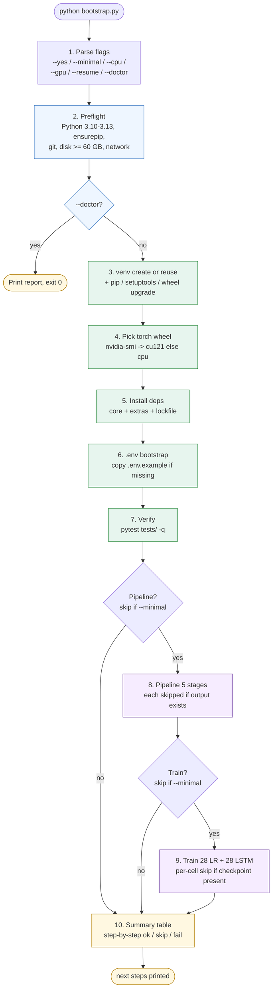

# Replication walkthrough

One reading, one purpose. A new person clones the repository, walks from a fresh checkout to a working backtest and a complete master evaluation, and stops. Every command below is the literal command to type. Every "expected output" is what should appear. If anything diverges, stop and resolve it before moving on. A broken upstream stage corrupts every stage downstream.

The README has the abbreviated quick-start. `docs/SETUP.md` has the long-form CLI reference. This file is the linear time-ordered walkthrough between the two.

## What this project is

`forex-algo-trading` is a reproducible minute-level FX strategy evaluation platform across seven currency pairs (EURUSD, GBPUSD, USDJPY, USDCHF, USDCAD, AUDUSD, NZDUSD) at one-minute resolution from 2015-01-01 to 2025-12-31. The point of the platform is fairness. Every strategy in the system, rule-based or learned, runs against identical bars, identical pip-spread costs, identical splits, and is scored on the same composite (35% net Sharpe + 25% Sortino + 25% Calmar + 15% drawdown safety, with hard gates on `n_trades < 10` and `max_drawdown < -0.95`). Three research questions sit on top: RQ0 reproducibility, RQ1 session conditioning, RQ2 multi-scale LSTM versus Logistic Regression. The deliverable is the platform plus answers to those three questions on the locked 2024 to 2025 test window.

## Step 1: prerequisites

| Requirement | Minimum | Check command | Expected |
|-------------|---------|---------------|----------|
| Python | 3.11 | `python --version` | `Python 3.11.x` or higher (3.13 known good) |
| Git | 2.x | `git --version` | `git version 2.x.x` |
| pip | recent | `pip --version` | `pip XX.Y from ...` |
| Free disk | 50 GB | `df -h .` (Unix) or `dir` (Windows) | shows free space on the partition |
| Network | required for stage 1 | `curl -I https://www.histdata.com` | `HTTP/2 200` or similar |

The 50 GB requirement is dominated by the four gitignored data directories (`data/`, `features/`, `labels/`, `datasets/`). Smaller working set if cleaned parquets already exist on disk: roughly 2 GB.

## Step 2: clone

```bash
git clone https://github.com/Kanyal-HarsH/forex-algo-trading.git
cd forex-algo-trading
```

After clone, the top level contains: `backtest/`, `scripts/`, `config/`, `tests/`, `docs/`, `models/`, `scalers/`, plus `README.md`, `ARCHITECTURE.md`, `requirements.txt`, `bootstrap.py`, `pyproject.toml`, `.env.example`, `.gitignore`. The `models/` and `scalers/` directories ship as empty trees via `.gitkeep` files.

Confirm the layout:

```bash
ls
```

## Step 3: pick a setup path

Both paths reach the same end state. Path A is the faster way through a first run; Path B is what to use when a stage needs partial rerun or close inspection along the way.

### When to pick which

| Scenario | Path |
|----------|------|
| First clone, single machine, single user | A |
| Bootstrap halted partway and you want to re-run from the breakpoint | A with `--resume` |
| Debugging a stage and inspecting outputs between steps | B |
| Editing scripts between pipeline stages | B |
| CI / unattended setup | A with `--yes` |
| Air-gapped or restricted-proxy environment | B (or A with `--offline`) |

### Path A: bootstrap script (recommended)

`bootstrap.py` collapses preflight, environment setup, dependency install, verification, pipeline, and training into a single invocation. A stage whose outputs are already on disk is skipped, which makes the script safe to re-run. Per-stage status is persisted in `.bootstrap_state.json`, and `--resume` consults that file to continue from the first unfinished step. Every subprocess call and its exit code is appended to `./bootstrap.log` for post-mortem inspection.

Common invocations:

```bash
python bootstrap.py --doctor          # diagnostic report only; no installs
python bootstrap.py --minimal         # env only; skip pipeline and training
python bootstrap.py --yes             # full unattended setup end to end
python bootstrap.py --resume          # continue from the last failed stage
```

The flag groups:

- Setup variant: `--yes`, `--minimal`, `--with-pdf` (also install playwright + chromium for PDF report export).
- Environment: `--cpu` / `--gpu` force the torch wheel choice (default: autodetect via `nvidia-smi`); `--rebuild-venv` deletes and recreates `./venv`; `--offline` refuses network calls and fails early if any are needed; `--no-tests` skips the pytest verification.
- Resume / re-run: `--resume` continues from the last unfinished stage; `--force-stage NAME` re-runs one stage by name (repeatable), with `NAME` in `download clean features labels split train`.
- Diagnostics: `--doctor` prints a Python / pip / OS / disk / CUDA / network report and exits; `--log PATH` overrides the log path.

Path A flow:



After the script completes, activate the environment:

```bash
source venv/bin/activate          # macOS / Linux
venv\Scripts\activate             # Windows PowerShell
```

Skip ahead to step 5 if you let bootstrap stop at `--minimal`, or to step 10 if bootstrap ran the pipeline and training.

### Path B: script-by-script (debugging and partial reruns)

Path B unfolds the same operations one command at a time. The trade-off is verbosity in exchange for visibility: a bad output is spotted at the line where it appears, not several minutes later when a downstream stage chokes on the bad input.

```bash
python -m venv venv
source venv/bin/activate                                  # Windows: venv\Scripts\activate
python -m pip install --upgrade pip setuptools wheel
pip install -r requirements-core.txt
pip install -r requirements-extras.txt
```

For GPU machines, install torch with the CUDA index before the two `pip install -r` lines:

```bash
pip install --upgrade torch --index-url https://download.pytorch.org/whl/cu121
```

For PDF export, opt in after the rest installs cleanly:

```bash
pip install playwright~=1.45
python -m playwright install chromium
```

Both `requirements-core.txt` and `requirements-extras.txt` use compatible-release pins (`~=`), which lets pip substitute a patch release when the originally tested version has dropped off PyPI. For exact reproduction of a known-good environment, `bootstrap.py` runs `pip freeze` after a clean install and writes the result to `requirements.lock.txt`. The top-level `requirements.txt` still resolves correctly; it has been reduced to a back-compat shim that `-r`-includes both split files in order.

Path B flow with the "stop and verify" checkpoint after each step:

```mermaid
flowchart TD
    B0([git clone the repo]) --> B1[Step 1. Prereqs<br/>python --version 3.10-3.13<br/>git --version, df -h .]
    B1 --> B2[Step 2. python -m venv venv<br/>activate venv]
    B2 --> B3[Step 3. pip install -U pip<br/>pip install -r requirements-core.txt<br/>pip install -r requirements-extras.txt]
    B3 --> B4[Step 4. cp .env.example .env<br/>edit if needed]
    B4 --> B5[Step 5. pytest tests/ -q<br/>VERIFY: 63 passed]
    B5 --> B6[Step 6. Pipeline]

    B6 --> B6a[6a. download_fx_data.py<br/>VERIFY: data/parquet/PAIR/*.parquet<br/>SKIP if shipped in-tree]
    B6a --> B6b[6b. clean_fx_data.py<br/>VERIFY: data/processed/cleaned/*]
    B6b --> B6c[6c. features_fx_data.py<br/>VERIFY: features/pair/* with 70 cols]
    B6c --> B6d[6d. labels_fx_data.py<br/>VERIFY: labels/pair/*]
    B6d --> B6e[6e. split_fx_data.py<br/>VERIFY: datasets/train, val, test<br/>+ scalers/PAIR_scaler.pkl]

    B6e --> B7[Step 7. train_all.py --model-type all<br/>VERIFY: 56 files across<br/>models/global, session/london, ny, asia]
    B7 --> B8[Step 8. One backtest<br/>backtest/run_backtest.py<br/>--pair EURUSD --strategy LR_global<br/>--from 2024-01-02 --to 2024-01-02]
    B8 --> B9[Step 9. master_eval.py<br/>--eval-year 2024 --spreads 1.0<br/>VERIFY: output/master_eval/latest_run.txt<br/>points at run_RUN_ID/master_report.txt]
    B9 --> B_END([Done. Cross-check<br/>results_all.csv vs prior run<br/>for RQ0])

    classDef setup fill:#eef6ff,stroke:#3a78c2;
    classDef pipe fill:#f6ecff,stroke:#6f3fa1;
    classDef train fill:#ffeede,stroke:#cc5500;
    classDef done fill:#fff8e1,stroke:#b07b00;
    class B1,B2,B3,B4,B5 setup;
    class B6,B6a,B6b,B6c,B6d,B6e pipe;
    class B7 train;
    class B8,B9,B_END done;
```



Continue with step 4 for `.env` setup, then step 5 for verification, then the pipeline in step 6.

## Step 4: configuration via `.env`

All runtime constants live in `config/constants.py`. Most are overrideable via environment variables that `python-dotenv` loads at startup. Copy the documented example and edit:

```bash
cp .env.example .env
```

Most relevant overrides:

| Variable | Default | Effect |
|----------|---------|--------|
| `TRADING_DAYS_PER_YEAR` | 252 | Annualisation factor numerator |
| `BARS_PER_TRADING_DAY` | 390 | Annualisation factor denominator. Use 1440 for FX 24-hour annualisation. |
| `MIN_BARS_PER_DAY` | 1200 | Minimum 1-minute bars to keep a calendar day during cleaning |
| `PURGE_ROWS` | 15 | Tail rows purged from training to prevent label leakage |
| `HORIZON_PRIMARY` | 5 | Forward-return horizon for the primary label |
| `HORIZON_SECONDARY` | 15 | Secondary forward-return horizon |
| `LOG_LEVEL` | INFO | Root log level |
| `DEFAULT_CAPITAL` | 10000.0 | Starting capital for backtests |
| `TP_SL_GRID` | `10,5;15,7;...` | TP/SL grid used by T3 of the rule-based path |

Locked split dates (`TRAIN_END=2021-12-31`, `VAL_START=2022-01-01`, `VAL_END=2023-12-31`, `TEST_START=2024-01-01`, `TEST_END=2025-12-31`) and the per-pair pip-spread table `PAIR_SPREAD_PIPS` are not env-overridable. Changing them invalidates comparability across runs.

## Step 5: verify the install before touching data

The fastest signal that the environment is wired correctly is the test suite. Tests use synthetic fixtures from `tests/conftest.py`, so the gitignored data directories are not needed.

The flag used below:

- `-q`: quiet mode (one dot per passing test instead of full per-test output)

```bash
python -m pytest tests/ -q
```

Expected: every test passes (around 60 tests across 12 files). A failure here means the environment is wrong; do not proceed.

Three CLI sanity checks:

```bash
python scripts/master_eval.py --help
```

Expected: a help banner listing `--pairs --workers --t1-min-sharpe --spreads --ml-split --rule-based-only --ml-only --eval-year --from --to --out --output-dir`.

```bash
python backtest/run_backtest.py --help
```

Expected: a help banner listing `--pair --strategy --split --from --to --folds --capital --spread --tp-pips --sl-pips --max-hold --session --entry-time --resample --direction --mode --out --no-browser`.

```bash
python scripts/train_model.py --help
```

Expected: a help banner listing `--pair --model-type --session --force --c-sweep --batch-size --no-amp` plus a positional `code` shortcode argument.

For a quick visual check of the report format without running the pipeline, open the pre-generated [`docs/assets/sample_report.html`](assets/sample_report.html) in a browser. For a real first run, continue.

## Step 6: bootstrap the data pipeline (stages 1 to 5)

The multi-hour part of replication. Each stage is a separate script. Each writes to a fixed location with a fixed schema. If a stage fails, fix it and re-run only that stage; downstream stages do not need to be re-run unless their input actually changes.

### Stage 1: download

```bash
python scripts/download_fx_data.py
```

Scrapes `https://www.histdata.com` for one-minute ASCII bar ZIPs for each pair x year (2015 to 2025), unzips them into `data/extracted/{PAIR}/`, and produces a yearly Parquet under `data/parquet/{PAIR}/`.

Expected runtime: 30 to 60 minutes depending on link speed. The script retries up to 3 times per file with a 5-second wait.

Expected directory state:

```
data/extracted/EURUSD/   yearly CSVs
data/extracted/GBPUSD/   yearly CSVs
... one folder per pair
data/parquet/EURUSD/     yearly Parquets
... one folder per pair
```

### Stage 2: clean

```bash
python scripts/clean_fx_data.py
```

Validates the OHLC bars, filters out calendar days with fewer than `MIN_BARS_PER_DAY` (default 1200) bars, normalises timestamps to UTC, writes one consolidated cleaned Parquet per pair to `data/processed/cleaned/{PAIR}_2015_2025_clean.parquet`. A summary CSV lands under `data/processed/reports/`.

Expected output column subset: `timestamp_est`, `timestamp_utc`, `open`, `high`, `low`, `close`, `volume`, `session` (one of `Asia`, `London`, `Overlap`, `New_York`).

Runtime: 5 to 10 minutes.

### Stage 3: features

The flags used below:

- `--force`: recompute features even if the per-pair Parquet already exists (omit on the first run)
- `--drop-warmup`: drop warmup rows where rolling features are NaN (omit unless explicitly needed)

```bash
python scripts/features_fx_data.py
```

Computes six feature families on the cleaned bars, writes them per-pair to `features/pair/`. Around 70 columns per pair after F1 to F5 land:

- F1 Time and session: `hour`, `day_of_week`, `is_overlap_session`, `minute_of_day`, `hour_sin`, `hour_cos`, `session_asia`, `session_london`, `session_ny`, `session_overlap`, `is_month_end`
- F2 Returns and range: `ret_1`, `ret_5`, `ret_15`, `log_ret_1`, `abs_ret_1`, `range`, `range_pct`, `range_ma_10`, `range_ma_30`
- F3 Multi-scale volatility: `rv_10`, `rv_30`, `rv_60`, `rv_ratio_10_60`, `volatility_regime_high`, `same_minute_prev_day_logrange`
- F4 Cross-pair: `{OTHER_PAIR}_ret_1_xpair`, `{OTHER_PAIR}_ret_5_xpair` for each of the six other pairs
- F5 Trend and TA: `sma_10`, `sma_30`, `sma_60`, `sma_120`, `price_to_sma_30`, `price_to_sma_60`, `mom_5`, `mom_15`, `mom_30`, `rsi_14`

Runtime: 20 to 60 minutes. The largest stage by wall time.

### Stage 4: labels

```bash
python scripts/labels_fx_data.py
```

Builds three-class forward-return labels per pair using a pair-specific FLAT band, calibrated on the training distribution. Output: `labels/pair/{PAIR}_labels.parquet`. Label values are `{-1, 0, +1}` for DOWN, FLAT, UP. Two horizons: `HORIZON_PRIMARY` (5 bars by default) and `HORIZON_SECONDARY` (15 bars).

Runtime: 5 to 10 minutes.

### Stage 5: splits, folds, scalers

The flags used below:

- `--train-end`: training-window end date (default `TRAIN_END` from `config/constants.py`)
- `--val-end`: validation-window end date (default `VAL_END`)
- `--purge-rows`: tail rows purged from training to prevent label leakage (default `PURGE_ROWS`, must be `>= HORIZON_SECONDARY`)
- `--n-folds`: walk-forward fold count (default `DEFAULT_N_FOLDS`)
- `--force`: overwrite existing fixed splits and folds
- `--force-folds`: overwrite only the walk-forward folds
- `--force-fixed`: overwrite only the fixed train/val/test splits
- `--skip-scaler`: skip refitting the per-pair `StandardScaler`

```bash
python scripts/split_fx_data.py
```

What it produces:

- Train/val/test parquets to `datasets/train/`, `datasets/val/`, `datasets/test/`, one parquet per pair
- 5 walk-forward folds to `datasets/folds/fold_0/` through `datasets/folds/fold_4/`, accessed via `config.constants.fold_parquet_path(pair, k, split_kind)`
- Session-filtered training subsets to `datasets/train_london/`, `datasets/train_ny/`, `datasets/train_asia/`, used by session-conditional model training. London training data includes both `London` and `Overlap` rows; NY includes `New_York` and `Overlap`; Asia is `Asia`-only.
- A per-pair `StandardScaler` fit on the training split (on the 18-feature `LR_FEATURES` list), saved to `scalers/{PAIR}_scaler.pkl` as a dict with `scaler` (the fitted `StandardScaler`) and `feature_cols` (the column-order `list[str]`).

Runtime: 10 to 15 minutes.

Total runtime for stages 1 to 5 on a recent laptop: 90 minutes to 3 hours. Stage 3 dominates.

## Step 7: train the models

Layer 1 (rule-based, six families, thirteen named strategies) needs no training. Layers 2 (LR) and 3 (multi-scale LSTM) need training.

### Train one cell

The flags used below:

- `--pair EURUSD`: the currency pair to train on
- `--model-type lr`: model family, either `lr` (Logistic Regression) or `lstm` (multi-scale LSTM)
- `--session global`: training session filter, one of `global`, `london`, `ny`, `asia`
- `--c-sweep`: (LR only) sweep `LR_C_VALUES = (0.001, 0.01, 0.1, 1.0)` and pick the best C on validation Sharpe; recommended for the global-session run, then session-conditional cells reuse the chosen C
- `--batch-size`: (LSTM only) mini-batch size (default 2048; reduce to 512 if memory is tight)
- `--no-amp`: (LSTM only) disable automatic mixed precision (use if NaN losses appear)
- `--force`: overwrite existing model files

```bash
python scripts/train_model.py --pair EURUSD --model-type lr --session global --c-sweep
python scripts/train_model.py --pair EURUSD --model-type lr --session london
python scripts/train_model.py --pair EURUSD --model-type lr --session ny
python scripts/train_model.py --pair EURUSD --model-type lr --session asia
python scripts/train_model.py --pair EURUSD --model-type lstm --session global
```

The trainer also accepts a positional shortcode for the same intent. Session aliases for the shortcode form: `gl=global`, `ldn=london`, `ny=ny`, `as=asia`.

```bash
python scripts/train_model.py eurusd-lr-gl --c-sweep
python scripts/train_model.py eurusd-lr-ldn
python scripts/train_model.py eurusd-lr-ny
python scripts/train_model.py eurusd-lr-as
python scripts/train_model.py eurusd-lstm-gl
```

Save locations:

```
models/global/{PAIR}_logreg_model.pkl
models/global/{PAIR}_lstm_model.pt
models/session/london/{PAIR}_logreg_model.pkl
models/session/london/{PAIR}_lstm_model.pt
models/session/ny/{PAIR}_logreg_model.pkl
models/session/ny/{PAIR}_lstm_model.pt
models/session/asia/{PAIR}_logreg_model.pkl
models/session/asia/{PAIR}_lstm_model.pt
```

LSTM checkpoint keys: `model_state_dict`, `short_input_size`, `long_input_size`, `session_size`, `long_feature_cols`. The `long_feature_cols` list is needed at inference because `same_minute_prev_day_logrange` is conditionally included if it was present at training time.

### Train every cell in one call

The flags used below:

- `--model-type lr`: train Logistic Regression cells only (default)
- `--model-type lstm`: train LSTM cells only
- `--model-type all`: train both LR and LSTM cells
- `--pairs eurusd gbpusd`: restrict to a subset (default `all`)
- `--no-c-sweep`: skip the LR regularisation sweep
- `--force`: overwrite existing models

```bash
python scripts/train_all.py --model-type all
```

Per-cell runtime: under 5 minutes for an LR cell, 40 to 90 minutes for an LSTM cell. Total grid runtime for `--model-type all`: roughly 8 to 14 hours unattended.

### Audit the model inventory

```bash
ls models/global/
ls models/session/london/
ls models/session/ny/
ls models/session/asia/
```

Total expected at full coverage: 7 pairs x 4 sessions x 2 model types = 56 checkpoints.

## Step 8: run a single backtest (per-strategy CLI)

The standalone backtest CLI is `backtest/run_backtest.py`. It accepts both rule-based strategy names from `STRATEGY_REGISTRY` and ML strategy names of the form `{LR|LSTM}_{global|london|ny|asia}`.

The thirteen rule-based strategy names registered in `backtest/strategies.py`:

```
MACrossover_f20_s50_EMA   MACrossover_f50_s200_EMA   MACrossover_f20_s50_SMA
Momentum_lb60             Momentum_lb120
Donchian_p20              Donchian_p55
RSI_p14_os30_ob70         RSI_p14_os20_ob80
BB_p20_std2_0             BB_p60_std2_0
MACD_f26_s65_sig9         MACD_f78_s195_sig13
```

### A rule-based one-day smoke test on the test split

The flags used below:

- `--pair EURUSD`: the currency pair to test
- `--strategy RSI_p14_os30_ob70`: the RSI mean-reversion strategy with period 14, oversold 30, overbought 70
- `--split test`: load the locked test split parquet (`datasets/test/`)
- `--from 2024-01-02 --to 2024-01-02`: a single trading day window
- `--capital 10000`: starting capital in USD
- `--spread 0.6`: override the spread to 0.6 pips (the EURUSD default)
- `--tp-pips 20`: take-profit at 20 pips
- `--sl-pips 10`: stop-loss at 10 pips
- `--no-browser`: write the HTML report without auto-opening it

```bash
python backtest/run_backtest.py --pair EURUSD --strategy RSI_p14_os30_ob70 --split test --from 2024-01-02 --to 2024-01-02 --capital 10000 --spread 0.6 --tp-pips 20 --sl-pips 10 --no-browser
```

Output: a summary printed to stdout with the 13 metrics, plus an HTML report written to `backtest/reports/`.

### LR model on the same window

The flags used below:

- `--pair EURUSD`: the currency pair to test
- `--strategy LR_global`: the global Logistic Regression model (the model file at `models/global/EURUSD_logreg_model.pkl` must exist)
- `--split test --from 2024-01-02 --to 2024-01-02`: same window as the rule-based smoke test
- `--capital 10000 --spread 0.6 --no-browser`: same cost and output settings

```bash
python backtest/run_backtest.py --pair EURUSD --strategy LR_global --split test --from 2024-01-02 --to 2024-01-02 --capital 10000 --spread 0.6 --no-browser
```

### LSTM model on the same window

The flags used below:

- `--strategy LSTM_global`: the global multi-scale LSTM model (the checkpoint file at `models/global/EURUSD_lstm_model.pt` must exist)
- All other flags unchanged from the LR invocation

```bash
python backtest/run_backtest.py --pair EURUSD --strategy LSTM_global --split test --from 2024-01-02 --to 2024-01-02 --capital 10000 --spread 0.6 --no-browser
```

### Three strategies head-to-head on a one-year window

The flags used below:

- `--strategy RSI_p14_os30_ob70 LR_global LSTM_global`: three strategies passed to the same flag (the `--strategy` flag accepts a list)
- `--from 2024-01-01 --to 2024-12-31`: the 2024 calendar year inside the test split
- All other flags as before

```bash
python backtest/run_backtest.py --pair EURUSD --strategy RSI_p14_os30_ob70 LR_global LSTM_global --split test --from 2024-01-01 --to 2024-12-31 --capital 10000 --spread 0.6 --no-browser
```

The HTML report renders all three equity curves on the same axes for visual comparison.

`--split` accepts `full`, `train`, `val`, `test`, and `fold_0` through `fold_4`. `fold_N` resolves to `datasets/folds/fold_N/{PAIR}_train.parquet`, never to a row-index slice of the monolithic train parquet. `full` resolves to `data/processed/cleaned/{PAIR}_2015_2025_clean.parquet`. `--folds N` runs walk-forward across N folds (uses the train split). `--session` restricts entries to one of `london` (07-16 UTC), `ny` (13-22 UTC), `asia` (23-08 UTC), or `overlap` (13-16 UTC). `--direction` selects `long_short`, `long_only`, or `short_only`.

## Step 9: run the master evaluation

The master evaluation runs the rule-based path (T1 to T5) and the ML cross-session sweep in a single pass, writing a definitive set of outputs to `output/master_eval/`.

### A single-year full run (recommended first run)

The flags used below:

- `--eval-year 2024`: restrict the evaluation window to the 2024 calendar year inside the locked test split (the script refuses years outside the test span)
- `--spreads 1.0`: a single spread multiplier (default sweep is `0.5 1.0 2.0`)

```bash
python scripts/master_eval.py --eval-year 2024 --spreads 1.0
```

Runtime: 35 to 50 minutes for all seven pairs.

### A single-pair smoke test

The flags used below:

- `--pairs EURUSD`: restrict to one pair (default `all`)
- `--eval-year 2024 --spreads 1.0`: as before

```bash
python scripts/master_eval.py --pairs EURUSD --eval-year 2024 --spreads 1.0
```

Runtime: 8 to 12 minutes.

### ML-only run (skip the rule-based tier)

The flags used below:

- `--ml-only`: skip the tiered rule-based path (T1 to T5)
- `--eval-year 2024 --spreads 1.0`: as before

```bash
python scripts/master_eval.py --ml-only --eval-year 2024 --spreads 1.0
```

Runtime: 10 to 15 minutes.

### The full test span across both calendar years

```bash
python scripts/master_eval.py --spreads 1.0
```

Runtime: 90 to 150 minutes.

Full flag map:

| Flag | Effect |
|------|--------|
| `--pairs` | Restrict to a subset of pairs (default `all`) |
| `--eval-year YYYY` | Restrict the evaluation window to one calendar year (within the test split) |
| `--from / --to` | Custom evaluation window (within the test split) |
| `--spreads 1.0 1.5 2.0` | Spread multipliers; default is the sweep `(0.5, 1.0, 2.0)` |
| `--ml-only` | Skip the rule-based path |
| `--rule-based-only` | Skip the ML path |
| `--ml-split test|val` | Which split the ML path evaluates on (default `test`) |
| `--workers N` | Parallel workers (default `cpu_count - 1`) |
| `--t1-min-sharpe` | T1 floor on val net_sharpe (default `-0.2`) |
| `--out FILE.txt` | Override the report path |
| `--output-dir DIR` | Override the output directory (default `output/master_eval/`) |

The script enforces that `--eval-year` falls inside the locked test split years (2024 or 2025). It refuses any year outside that range.

## Step 10: read the outputs

Every master-evaluation run writes the following into a per-run subfolder `output/master_eval/run_<RUN_ID>/`, where `<RUN_ID>` is the UTC timestamp of the invocation. A pointer to the most recent run directory is left at `output/master_eval/latest_run.txt`. Pass `--output-dir DIR` to write into `DIR` directly instead of the auto-generated subfolder.

- `master_report.txt`: the definitive text report. Sections cover the scoring system, per-pair buy-and-hold baselines on val and test, Part A rule-based (T1 to T5), Part B ML cross-session, DM test results, and the headline ranking.
- `results_rule_based.csv`: every T1 to T5 row with all 13 metrics.
- `results_ml.csv`: every ML cross-session row.
- `results_all.csv`: combined, sorted by composite_score.
- `best_worst_per_pair.csv`: per-pair extremes summary.
- `transfer_matrix_lr_{PAIR}.csv`: 4 by 4 Sharpe matrix per pair (training session by evaluation session). NaN cells indicate not-trained cells.
- `transfer_matrix_lstm_{PAIR}.csv`: same shape for LSTM.
- `session_generalisability.csv`: aggregated in-domain vs transfer pattern across pairs.
- `dm_test_results.csv`: four DM comparisons per pair (best_RB_vs_BAH, best_ML_vs_BAH, in-domain-vs-transfer, RB and ML champion-vs-runner-up). Newey-West HAC variance.
- `cost_breakeven.csv`: spread-multiplier breakpoint per strategy where net return falls to zero.

The composite score is computed identically for every tier and for the ML path:

```
composite = 0.35 * Sharpe_capped + 0.25 * Sortino_capped
          + 0.25 * Calmar_capped + 0.15 * DD_safety
caps:    Sharpe at 5.0, Sortino at 5.0, Calmar at 3.0
floors:  zero out negative values before weighting
DD_safety = max(0, (1 + max_drawdown) * 100)
hard gates: n_trades < 10 OR max_drawdown < -0.95  =>  composite = 0
grades: A>=80, B 60-79, C 40-59, D 20-39, F<20
```

Stability score is T4 only and is not part of the composite:

```
stability = fold_mean_sharpe - 0.5 * fold_std_sharpe
filter:    negative_fold_count > 2 OR n_trades < 10  =>  rejected
```

The tier sequence is selection-versus-evaluation disciplined:

```
T1  screen on val (top survivors per pair plus family-diversity floor)
T2  best (session, direction) on val
T3  best TP/SL combo on val (only if it beats T2 baseline)
T4  walk-forward stability on train folds
T5  one shot on the locked test split
```

T1 through T3 only ever touch val. T4 only ever touches the train folds. T5 is the only tier that touches the locked test split, and exactly once per evaluation cycle.

## Step 11: reproduce the headline result

The headline is the T5 plus ML rows in `master_report.txt` for a chosen window. To answer each research question:

**RQ0 reproducibility.** Run the master evaluation twice on the same machine with the same models on disk and the same arguments, writing each run to its own directory:

```bash
python scripts/master_eval.py --eval-year 2024 --spreads 1.0 --output-dir output/master_eval/rq0_run1
python scripts/master_eval.py --eval-year 2024 --spreads 1.0 --output-dir output/master_eval/rq0_run2
diff output/master_eval/rq0_run1/results_all.csv output/master_eval/rq0_run2/results_all.csv
```

The `diff` must produce no output. If it does, the platform is non-deterministic for the current configuration and RQ0 has been violated.

**RQ1 session conditioning.** Open `transfer_matrix_lr_{PAIR}.csv` and `transfer_matrix_lstm_{PAIR}.csv` for each pair. Compare the diagonal (in-session training and in-session evaluation) against the off-diagonal (transfer). Aggregate across pairs in `session_generalisability.csv`. The hypothesis: the diagonal beats the off-diagonal on net Sharpe.

**RQ2 LR vs LSTM.** Inside `master_report.txt`, compare the best LR composite to the best LSTM composite per pair. Cross-reference with the corresponding row in `dm_test_results.csv` to see whether the gap is significant at p < 0.05.

The platform is built so the answers are partial and qualified. It is unlikely that session conditioning helps every pair uniformly. It is unlikely that the LSTM beats LR on every pair. It is plausible that some pairs show one effect and other pairs show the other, and the structured outputs above are designed to surface those nuances rather than collapse them into a single headline number.

## Step 12: when to stop

Replication is complete when:

1. `python -m pytest tests/ -q` is green.
2. `output/master_eval/latest_run.txt` points at a `run_<RUN_ID>/` directory containing a `master_report.txt` produced by a run on the locked test split.
3. The headline ranking in `master_report.txt` and the per-pair transfer matrices match a re-run on the same configuration (RQ0 holds).
4. The four research-question answers can be read off the structured outputs: `transfer_matrix_*.csv` for RQ1, `dm_test_results.csv` for RQ2, the `diff` test above for RQ0.

At that point the platform has done its job. Any further interpretation belongs in [docs/FINDINGS.md](FINDINGS.md), which is a placeholder until a human author fills it in from the structured outputs above.
